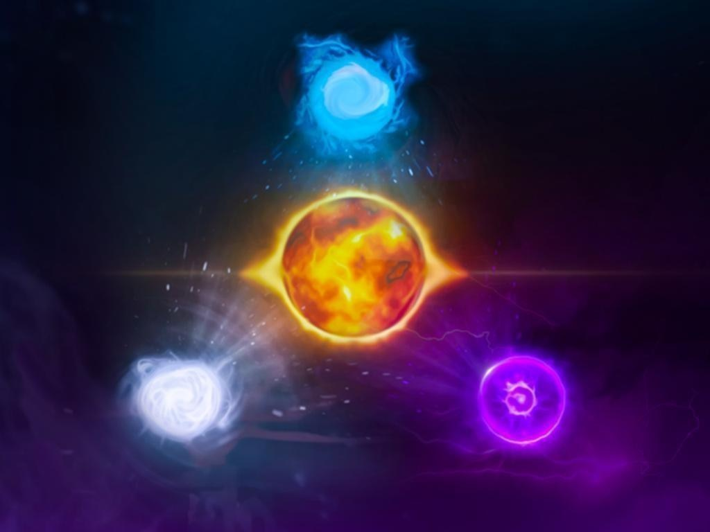

<!--
*** Thanks for checking out the Best-README-Template. If you have a suggestion
*** that would make this better, please fork the repo and create a pull request
*** or simply open an issue with the tag "enhancement".
*** Thanks again! Now go create something AMAZING! :D
-->


<!-- PROJECT SHIELDS -->
<!--
*** I'm using markdown "reference style" links for readability.
*** Reference links are enclosed in brackets [ ] instead of parentheses ( ).
*** See the bottom of this document for the declaration of the reference variables
*** for contributors-url, forks-url, etc. This is an optional, concise syntax you may use.
*** https://www.markdownguide.org/basic-syntax/#reference-style-links
-->
<!-- [![Contributors][contributors-shield]][contributors-url]
[![Forks][forks-shield]][forks-url]
[![Stargazers][stars-shield]][stars-url]
[![Issues][issues-shield]][issues-url]
[![MIT License][license-shield]][license-url]
[![LinkedIn][linkedin-shield]][linkedin-url] -->


<!-- PROJECT LOGO -->
<br />
<p align="center">
  <a href="https://github.com/raulcorreia7/dota1x6_decompile">
    
  </a>

  <h3 align="center">Dota 1x6 Decompile</h3>

  <p align="center">
    Decompiliation of the popular dota 1x6 mod
    <br />
    <!-- <a href="https://github.com/othneildrew/Best-README-Template"><strong>Explore the docs »</strong></a>
    <br />
    <br />
    <a href="https://github.com/othneildrew/Best-README-Template">View Demo</a>
    · -->
    <a href="https://github.com/othneildrew/Best-README-Template/issues">Report Bug</a>
    ·
    <a href="https://github.com/othneildrew/Best-README-Template/issues">Request Feature</a>
  </p>
</p>


<!-- TABLE OF CONTENTS -->
<details open="open">
  <summary>Table of Contents</summary>
  <ol>
    <li>
      <a href="#about-the-project">About The Project</a>
      <ul>
        <li><a href="#built-with">Built With</a></li>
      </ul>
    </li>
    <!-- <li>
      <a href="#getting-started">Getting Started</a>
      <ul>
        <li><a href="#prerequisites">Prerequisites</a></li>
        <li><a href="#installation">Installation</a></li>
      </ul>
    </li> -->
    <!-- <li><a href="#usage">Usage</a></li>
    <li><a href="#roadmap">Roadmap</a></li>
    <li><a href="#contributing">Contributing</a></li> -->
    <li><a href="#license">License</a></li>
    <li><a href="#contact">Contact</a></li>
    <li><a href="#acknowledgements">Acknowledgements</a></li>
  </ol>
</details>


<!-- ABOUT THE PROJECT -->
## About The Project

<!-- [![Product Name Screen Shot][product-screenshot]](https://example.com) -->

This is the decompiled source code for the dota mod ```dota 1x6```.
As of 29/04/2022, the game disappeared from the workshop. This is the decompilation of the game assets, leaving everyone able to modify as you please.


## Interesting tools
* [GCFScape](https://developer.valvesoftware.com/wiki/GCFScape)
* [Source 2 Resource Viewer](https://vrf.steamdb.info/)

<!-- LICENSE -->
## License

I'm distributing the project under GPL2 license, with copyrights under the name ```Xeno```.
See `LICENSE` for more information.

Disclaimer : This repository might disappear if ```Xeno``` asks me to.

<!-- CONTACT -->
## Contact

Raúl Correia - [@Raul_Correia](https://twitter.com/Raul_Correia)

Project Link: [https://github.com/raulcorreia7/dota1x6_decompile](https://github.com/raulcorreia7/dota1x6_decompile)


<!-- ACKNOWLEDGEMENTS -->
## Acknowledgements
* Xeno
* Dota 2 Community


<!-- MARKDOWN LINKS & IMAGES -->
<!-- https://www.markdownguide.org/basic-syntax/#reference-style-links -->
[contributors-shield]: https://img.shields.io/github/contributors/othneildrew/Best-README-Template.svg?style=for-the-badge
[contributors-url]: https://github.com/othneildrew/Best-README-Template/graphs/contributors
[forks-shield]: https://img.shields.io/github/forks/othneildrew/Best-README-Template.svg?style=for-the-badge
[forks-url]: https://github.com/othneildrew/Best-README-Template/network/members
[stars-shield]: https://img.shields.io/github/stars/othneildrew/Best-README-Template.svg?style=for-the-badge
[stars-url]: https://github.com/othneildrew/Best-README-Template/stargazers
[issues-shield]: https://img.shields.io/github/issues/othneildrew/Best-README-Template.svg?style=for-the-badge
[issues-url]: https://github.com/othneildrew/Best-README-Template/issues
[license-shield]: https://img.shields.io/github/license/othneildrew/Best-README-Template.svg?style=for-the-badge
[license-url]: https://github.com/othneildrew/Best-README-Template/blob/master/LICENSE.txt
[linkedin-shield]: https://img.shields.io/badge/-LinkedIn-black.svg?style=for-the-badge&logo=linkedin&colorB=555
[linkedin-url]: https://linkedin.com/in/othneildrew
[product-screenshot]: images/screenshot.png
